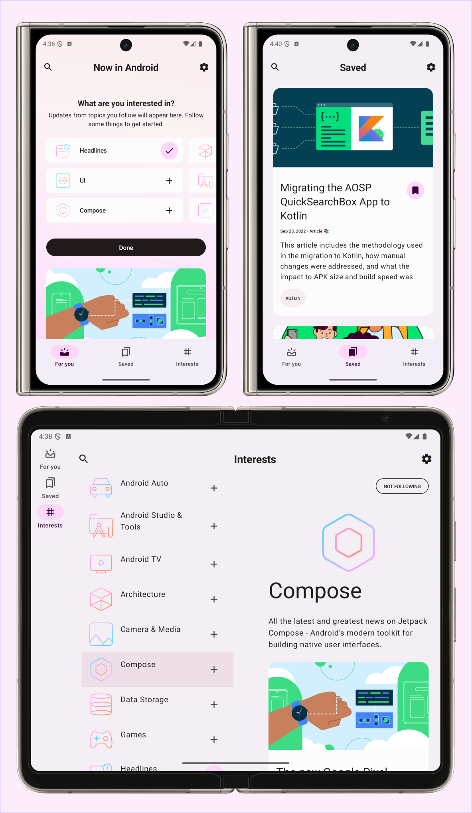

Starception Submission App
==========================

**An enhanced Android app based on Google's Now in Android architecture, featuring comprehensive Islamic prayer times functionality.**

This repository contains the **Starception Submission** app - a fully functional Android application built entirely with Kotlin and Jetpack Compose. It extends Google's Now in Android sample with a complete Islamic prayer times system while maintaining all original functionality.

**Learn about the original architecture in the [architecture learning journey](docs/ArchitectureLearningJourney.md) and [modularization learning journey](docs/ModularizationLearningJourney.md).**

The app demonstrates modern Android development practices and serves as both a functional news app and a comprehensive prayer times calculator for Muslims worldwide.

# Features

## Core News App Features
**Starception Submission** retains all original Now in Android functionality:
- Browse content from the [Now in Android](https://developer.android.com/series/now-in-android) series
- Follow topics of interest and receive notifications for new content
- Bookmark articles for later reading
- Dark/light theme support with Material You dynamic colors
- Offline-first architecture with local caching

## Islamic Prayer Times (New Feature)
**Comprehensive prayer times system with advanced features:**

### Prayer Time Calculations
Our app implements precise Islamic prayer time calculations using advanced astronomical algorithms:

#### **Astronomical Foundation**
- **Julian Day Conversion**: Converts calendar dates to astronomical time scale for precise calculations
- **Solar Position Calculations**: Real-time sun declination, equation of time, and hour angle calculations
- **Geographic Corrections**: Accounts for Earth's elliptical orbit, atmospheric refraction, and altitude adjustments
- **Coordinate Transformations**: Accurate geographic coordinate handling with timezone calculations

#### **Islamic Prayer Time Rules**
Each prayer follows specific astronomical criteria:
- **Fajr (Pre-dawn)**: Sun at -15° to -19.5° below horizon (varies by calculation method)
- **Sunrise**: Sun crosses geometric horizon with atmospheric refraction correction (-0.833°)
- **Dhuhr (Noon)**: Sun reaches maximum elevation (solar noon with equation of time correction)
- **Asr (Afternoon)**: Shadow length equals 1x or 2x object height (depending on madhab)
- **Maghrib (Sunset)**: Sun sets below geometric horizon (same angle as sunrise)
- **Isha (Night)**: Sun at -15° to -18° below horizon OR fixed minutes after Maghrib

#### **Supported Calculation Methods**
- **Muslim World League (MWL)**: Fajr -18°, Isha -17° - Most widely used globally
- **ISNA**: Fajr -15°, Isha -15° - Used in North America
- **Umm al-Qura (Makkah)**: Fajr -18.5°, Isha 90 min after Maghrib - Official method of Saudi Arabia
- **Egyptian Authority**: Fajr -19.5°, Isha -17.5° - Used in Egypt and nearby regions
- **University of Islamic Sciences (Karachi)**: Fajr -18°, Isha -18° - Used in Pakistan and India
- **MUIS (Singapore)**: Fajr -20°, Isha -18° - Used in Singapore, Malaysia, Brunei
- **Shia Ithna Ashari**: Fajr -16°, Isha -14°, Maghrib +4 min - Used by Shia communities
- **Institute of Geophysics (Tehran)**: Fajr -17.7°, Isha -14°, Maghrib +4 min - Used in Iran

#### **Advanced Features**
- **Madhab Support**: Standard (Shafi'i, Maliki, Hanbali) and Hanafi methods for Asr calculation
- **High Latitude Adjustments**: Multiple methods for polar regions including Middle of Night, One-Seventh of Night, Angle Based, and Nearest Latitude
- **Custom Adjustments**: Manual time offsets for each prayer and custom sun angle overrides
- **Error Handling**: Comprehensive fallback systems for edge cases and calculation failures

### Location Services
- **Smart Location Detection**: Multi-strategy location acquisition with 3-second timeouts to prevent UI blocking
- **Enhanced GPS Service**: Prevents app hanging in elevators and poor signal areas
- **Manual Location Setting**: Search and set location manually with geocoding support
- **Automatic Location Updates**: Background location monitoring every 30 minutes
- **Timezone Calculation**: Accurate timezone detection for worldwide locations

### User Experience
- **Instant Startup**: Cached prayer times for immediate display
- **Real-time Updates**: Current/next prayer status with time-until-next calculations
- **Material 3 Design**: Modern UI with expressive design elements
- **Analog Watch Component**: Visual prayer time display with smooth animations
- **Pull-to-refresh**: Manual refresh with smooth animations
- **Notification Support**: Prayer time alerts and reminders

### Technical Features
- **Offline-first Architecture**: Works without internet connection
- **Background Services**: Automatic prayer time updates and notifications
- **Performance Optimized**: Efficient calculations with smart caching
- **Memory Efficient**: Proper resource management and leak prevention

## Screenshots



# Development Environment

**Now in Android** uses the Gradle build system and can be imported directly into Android Studio (make sure you are using the latest stable version available [here](https://developer.android.com/studio)). 

Change the run configuration to `app`.


The `demoDebug` and `demoRelease` build variants can be built and run (the `prod` variants use a backend server which is not currently publicly available).


Once you're up and running, you can refer to the learning journeys below to get a better
understanding of which libraries and tools are being used, the reasoning behind the approaches to
UI, testing, architecture and more, and how all of these different pieces of the project fit
together to create a complete app.

# Architecture

The **Now in Android** app follows the
[official architecture guidance](https://developer.android.com/topic/architecture) 
and is described in detail in the
[architecture learning journey](docs/ArchitectureLearningJourney.md).

# Modularization

The **Now in Android** app has been fully modularized and you can find the detailed guidance and
description of the modularization strategy used in
[modularization learning journey](docs/ModularizationLearningJourney.md).

# Build

The app contains the usual `debug` and `release` build variants. 

In addition, the `benchmark` variant of `app` is used to test startup performance and generate a
baseline profile (see below for more information).

`app-nia-catalog` is a standalone app that displays the list of components that are stylized for
**Now in Android**.

The app also uses
[product flavors](https://developer.android.com/studio/build/build-variants#product-flavors) to
control where content for the app should be loaded from.

The `demo` flavor uses static local data to allow immediate building and exploring of the UI.

The `prod` flavor makes real network calls to a backend server, providing up-to-date content. At 
this time, there is not a public backend available.

For normal development use the `demoDebug` variant. For UI performance testing use the
`demoRelease` variant.

## Prayer Times Development
The Islamic prayer times functionality is fully integrated into the existing architecture:

### Build Configuration
- All prayer times code is included in both `demo` and `prod` flavors
- Uses the same modular architecture as the original app
- Prayer times work offline and don't require backend connectivity

### Key Build Commands for Prayer Times
- `./gradlew assembleDemoDebug` - Build with prayer times functionality
- `./gradlew installDemoDebug` - Install on device for testing prayer times
- `adb -s 4B221FDAP002T6 install -r app/build/outputs/apk/demo/debug/app-demo-debug.apk` - Install on specific Pixel 9 Pro device

### Testing Prayer Times
- Prayer times use real GPS location when available
- Falls back to default location (Mecca) when GPS is unavailable
- Manual location testing available through settings
- All calculation methods can be tested and compared 

# Testing

To facilitate testing of components, **Now in Android** uses dependency injection with
[Hilt](https://developer.android.com/training/dependency-injection/hilt-android).

Most data layer components are defined as interfaces.
Then, concrete implementations (with various dependencies) are bound to provide those interfaces to
other components in the app.
In tests, **Now in Android** notably does _not_ use any mocking libraries.
Instead, the production implementations can be replaced with test doubles using Hilt's testing APIs
(or via manual constructor injection for `ViewModel` tests).

These test doubles implement the same interface as the production implementations and generally
provide a simplified (but still realistic) implementation with additional testing hooks.
This results in less brittle tests that may exercise more production code, instead of just verifying
specific calls against mocks.

Examples:
- In instrumentation tests, a temporary folder is used to store the user's preferences, which is
  wiped after each test.
  This allows using the real `DataStore` and exercising all related code, instead of mocking the 
  flow of data updates.

- There are `Test` implementations of each repository, which implement the normal, full repository
  interface and also provide test-only hooks.
  `ViewModel` tests use these `Test` repositories, and thus can use the test-only hooks to
  manipulate the state of the `Test` repository and verify the resulting behavior, instead of
  checking that specific repository methods were called.

To run the tests execute the following gradle tasks: 

- `testDemoDebug` run all local tests against the `demoDebug` variant. Screenshot tests will fail
(see below for explanation). To avoid this, run `recordRoborazziDemoDebug` prior to running unit tests.
- `connectedDemoDebugAndroidTest` run all instrumented tests against the `demoDebug` variant. 

> [!NOTE]
> You should not run `./gradlew test` or `./gradlew connectedAndroidTest` as this will execute 
tests against _all_ build variants which is both unnecessary and will result in failures as only the
`demoDebug` variant is supported. No other variants have any tests (although this might change in future). 

## Screenshot tests
A screenshot test takes a screenshot of a screen or a UI component within the app, and compares it 
with a previously recorded screenshot which is known to be rendered correctly. 

For example, Now in Android has [screenshot tests](https://github.com/android/nowinandroid/blob/main/app/src/testDemo/kotlin/com/google/samples/apps/nowinandroid/ui/NiaAppScreenSizesScreenshotTests.kt)
to verify that the navigation is displayed correctly on different screen sizes 
([known correct screenshots](https://github.com/android/nowinandroid/tree/main/app/src/testDemo/screenshots)). 

Now In Android uses [Roborazzi](https://github.com/takahirom/roborazzi) to run screenshot tests
of certain screens and UI components. When working with screenshot tests the following gradle tasks are useful:

- `verifyRoborazziDemoDebug` run all screenshot tests, verifying the screenshots against the known
correct screenshots.
- `recordRoborazziDemoDebug` record new "known correct" screenshots. Use this command when you have
made changes to the UI and manually verified that they are rendered correctly. Screenshots will be
stored in `modulename/src/test/screenshots`.
- `compareRoborazziDemoDebug` create comparison images between failed tests and the known correct
images. These can also be found in `modulename/src/test/screenshots`. 

> [!NOTE]
> **Note on failing screenshot tests**   
> The known correct screenshots stored in this repository are recorded on CI using Linux. Other
platforms may (and probably will) generate slightly different images, making the screenshot tests fail. 
When working on a non-Linux platform, a workaround to this is to run `recordRoborazziDemoDebug` on the
`main` branch before starting work. After making changes, `verifyRoborazziDemoDebug` will identify only
legitimate changes. 

For more information about screenshot testing 
[check out this talk](https://www.droidcon.com/2023/11/15/easy-screenshot-testing-with-compose/).

# UI
The app was designed using [Material 3 guidelines](https://m3.material.io/). Learn more about the design process and 
obtain the design files in the [Now in Android Material 3 Case Study](https://goo.gle/nia-figma) (design assets [also available as a PDF](docs/Now-In-Android-Design-File.pdf)).

The Screens and UI elements are built entirely using [Jetpack Compose](https://developer.android.com/jetpack/compose). 

The app has two themes: 

- Dynamic color - uses colors based on the [user's current color theme](https://material.io/blog/announcing-material-you) (if supported)
- Default theme - uses predefined colors when dynamic color is not supported

Each theme also supports dark mode. 

The app uses adaptive layouts to
[support different screen sizes](https://developer.android.com/guide/topics/large-screens/support-different-screen-sizes).

Find out more about the [UI architecture here](docs/ArchitectureLearningJourney.md#ui-layer).

# Performance

## Benchmarks

Find all tests written using [`Macrobenchmark`](https://developer.android.com/topic/performance/benchmarking/macrobenchmark-overview)
in the `benchmarks` module. This module also contains the test to generate the Baseline profile.

## Baseline profiles

The baseline profile for this app is located at [`app/src/main/baseline-prof.txt`](app/src/main/baseline-prof.txt).
It contains rules that enable AOT compilation of the critical user path taken during app launch.
For more information on baseline profiles, read [this document](https://developer.android.com/studio/profile/baselineprofiles).

> [!NOTE]
> The baseline profile needs to be re-generated for release builds that touch code which changes app startup.

To generate the baseline profile, select the `benchmark` build variant and run the
`BaselineProfileGenerator` benchmark test on an AOSP Android Emulator.
Then copy the resulting baseline profile from the emulator to [`app/src/main/baseline-prof.txt`](app/src/main/baseline-prof.txt).

## Compose compiler metrics

Run the following command to get and analyse compose compiler metrics:

```bash
./gradlew assembleRelease -PenableComposeCompilerMetrics=true -PenableComposeCompilerReports=true
```

The reports files will be added to [build/compose-reports](build/compose-reports). The metrics files will also be 
added to [build/compose-metrics](build/compose-metrics).

For more information on Compose compiler metrics, see [this blog post](https://medium.com/androiddevelopers/jetpack-compose-stability-explained-79c10db270c8).

# License

**Now in Android** is distributed under the terms of the Apache License (Version 2.0). See the
[license](LICENSE) for more information.
