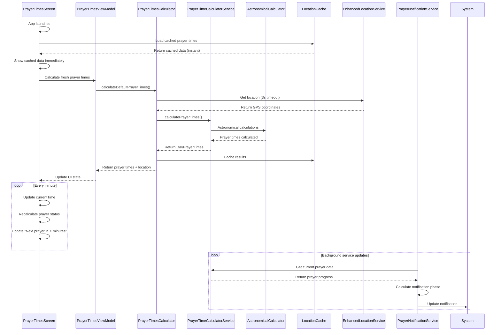

# Prayer Times Technical Documentation

This document provides comprehensive technical guidance on how the Islamic prayer times system calculates prayer times, updates the UI, and manages notifications in real-time.

## Table of Contents

1. [System Overview](#system-overview)
2. [Prayer Times Calculation Engine](#prayer-times-calculation-engine)
3. [UI Update Mechanisms](#ui-update-mechanisms)
4. [Notification System Architecture](#notification-system-architecture)
5. [Real-Time Updates Flow](#real-time-updates-flow)
6. [Performance Optimizations](#performance-optimizations)
7. [Error Handling & Fallbacks](#error-handling--fallbacks)
8. [Configuration & Customization](#configuration--customization)

## System Overview

The prayer times system is built with a multi-layered architecture that provides accurate Islamic prayer times with real-time updates, intelligent caching, and background notifications.

### Core Components

```
┌─── UI LAYER (Composable Screens)
│    ├── PrayerTimesScreen.kt - Main UI with real-time updates
│    ├── SwipeableBigTiles.kt - Interactive prayer cards
│    └── Animations/ - Smooth UI animations
│
├─── VIEW MODEL LAYER (State Management)  
│    ├── PrayerTimesViewModel.kt - Reactive state management
│    └── PrayerTimesUiState - Immutable UI state representation
│
├─── DATA LAYER (Business Logic)
│    ├── PrayerTimesCalculator.kt - Main calculation coordinator
│    ├── PrayerTimeCalculatorService.kt - Core astronomical calculations
│    └── AstronomicalCalculator.kt - Low-level astronomy algorithms
│
├─── LOCATION LAYER (GPS & Caching)
│    ├── EnhancedLocationService.kt - GPS with 3-second timeout
│    ├── LocationCache.kt - Intelligent location caching
│    └── PrayerSettingsRepository.kt - Settings persistence
│
└─── NOTIFICATION LAYER (Background Services)
     ├── PrayerNotificationService.kt - Foreground service
     ├── PrayerNotificationManager.kt - Notification logic
     └── Background update loops with smart phases
```

## Prayer Times Calculation Engine

> **📖 For detailed calculation methodology, see [PRAYER_CALCULATION_METHODOLOGY.md](PRAYER_CALCULATION_METHODOLOGY.md)**

### 1. Astronomical Foundation

The system uses precise astronomical calculations based on the sun's position relative to Earth:

**Core Astronomical Concepts:**
- **Julian Day Conversion**: Converts calendar dates to astronomical time scale for precise calculations
- **Solar Declination**: Sun's angle relative to Earth's equator (changes throughout the year)
- **Equation of Time**: Correction for Earth's elliptical orbit (sun's "fast/slow" cycle)
- **Hour Angles**: Mathematical representation of sun's position at specific elevation angles

**Key File: `AstronomicalCalculator.kt`**

```kotlin
// MAIN CALCULATION FLOW
fun calculateJulianDay(date: LocalDate, time: LocalTime): Double {
    // Converts Gregorian calendar to Julian Day for astronomical precision
    // Handles leap years, calendar corrections automatically
}

fun calculateSolarDeclination(julianDay: Double): Double {
    // Calculates sun's angle relative to Earth's equator
    // Essential for determining prayer time angles
}

fun calculateEquationOfTime(julianDay: Double): Double {
    // Corrects for Earth's elliptical orbit
    // Ensures accurate local solar time calculations
}
```

### 2. Islamic Prayer Time Rules

Each of the five daily prayers has specific astronomical criteria:

**Prayer Time Definitions:**
- **Fajr** (Pre-dawn): Sun at -15° to -19.5° below horizon (varies by calculation method)
- **Sunrise**: Sun crosses geometric horizon with atmospheric refraction correction (-0.833°)
- **Dhuhr** (Noon): Sun reaches maximum elevation (solar noon)
- **Asr** (Afternoon): Shadow length equals object height (1x) or 2x object height (Hanafi)
- **Maghrib** (Sunset): Sun sets below geometric horizon (same angle as sunrise)
- **Isha** (Night): Sun at -15° to -18° below horizon OR fixed minutes after Maghrib

**Key File: `PrayerTimeCalculatorService.kt`**

```kotlin
// MAIN PRAYER CALCULATION METHOD
fun calculatePrayerTimes(date: LocalDate, location: Location, settings: PrayerSettings): DayPrayerTimes? {
    
    // STEP 1: INPUT VALIDATION
    if (!location.isValid()) return null
    
    // STEP 2: ASTRONOMICAL FOUNDATION
    val julianDay = astronomicalCalculator.calculateJulianDay(date)
    
    // STEP 3: SOLAR POSITION CALCULATIONS  
    val solarNoon = astronomicalCalculator.calculateSolarNoon(location, julianDay)
    val sunrise = astronomicalCalculator.calculateSunrise(location, julianDay)
    val sunset = astronomicalCalculator.calculateSunset(location, julianDay)
    
    // STEP 4: ISLAMIC PRAYER-SPECIFIC CALCULATIONS
    val fajrTime = calculateFajrWithAdjustments(location, julianDay, settings)
    val asrTime = calculateAsrWithAdjustments(location, julianDay, settings) 
    val ishaTime = calculateIshaWithAdjustments(location, julianDay, settings, sunset)
    
    // STEP 5: USER CUSTOMIZATION APPLICATION
    // Apply user time offsets and calculation method preferences
    
    // STEP 6: RETURN COMPLETE PRAYER SCHEDULE
    return DayPrayerTimes(/* assembled prayer times */)
}
```

### 3. Calculation Method Variations

The system supports multiple Islamic calculation methods with different angles:

| Method | Organization | Fajr Angle | Isha Angle | Notes |
|--------|-------------|------------|------------|-------|
| **Muslim World League** | MWL | -18° | -17° | Most widely used globally |
| **ISNA** | Islamic Society of North America | -15° | -15° | Used in North America |
| **Umm al-Qura** | Makkah, Saudi Arabia | -18.5° | 90 min after Maghrib | Official method of Saudi Arabia |
| **Egyptian Authority** | Egypt | -19.5° | -17.5° | Used in Egypt and nearby regions |
| **University of Karachi** | Pakistan | -18° | -18° | Used in Pakistan and India |

### 4. High-Latitude Adjustments

For locations above 48° latitude where normal calculations may fail (midnight sun/polar night):

**Adjustment Methods:**
- **Middle of Night**: Divide night into equal portions
- **One-Seventh of Night**: Fajr/Isha occupy 1/7th of night duration  
- **Angle-Based**: Use proportional angle adjustments
- **Nearest Latitude**: Use calculations from nearest working latitude

## UI Update Mechanisms

### 1. Reactive State Management

The UI uses MVVM architecture with reactive state flows for real-time updates:

**Key File: `PrayerTimesViewModel.kt`**

```kotlin
// REACTIVE STATE MANAGEMENT
private val _uiState = MutableStateFlow(PrayerTimesUiState())
val uiState: StateFlow<PrayerTimesUiState> = _uiState.asStateFlow()

// AUTOMATIC SETTINGS SYNCHRONIZATION
init {
    viewModelScope.launch {
        settingsRepository.settingsFlow.collect { newSettings ->
            _settings.value = newSettings
            calculatePrayerTimes(showLoading = false) // Background update
        }
    }
}
```

**UI State Model:**
```kotlin
data class PrayerTimesUiState(
    val isLoading: Boolean = false,           // Prayer calculations in progress
    val isLoadingLocation: Boolean = false,   // GPS acquisition in progress  
    val isRefreshing: Boolean = false,        // Pull-to-refresh active
    val prayerTimes: DayPrayerTimes? = null, // Calculated prayer times
    val timeUntilNext: String? = null,        // "2h 30m until Asr"
    val location: Location? = null,           // Current location display
    val calculationMethod: CalculationMethod? = null, // Method transparency
    val error: String? = null                 // User-friendly error messages
)
```

### 2. Real-Time Clock Updates

The UI updates every minute to show live prayer status:

**Key File: `PrayerTimesScreen.kt`**

```kotlin
// LIVE CLOCK UPDATES - Updates current time every minute
LaunchedEffect(Unit) {
    while (true) {
        currentTime = LocalTime.now()      // Update current time
        kotlinx.coroutines.delay(60000)   // Wait 1 minute
    }
}

// PRAYER STATUS CALCULATION - Determines current/next prayer in real-time
fun getPrayerStatus(prayerName: String, currentTime: LocalTime, prayerTimes: DayPrayerTimes?): String {
    return when {
        // Prayer is happening right now
        isCurrentPrayerTime(currentTime, prayerTime, nextPrayerTime) -> "Current"
        // This is the next upcoming prayer
        isNextPrayerTime(currentTime, prayerTime) -> "Next"  
        // Prayer has already passed
        else -> "Completed"
    }
}
```

### 3. Instant Startup Strategy

The app shows data immediately on startup using cached data:

```kotlin
// INSTANT LOAD STRATEGY - Show cached data immediately, update in background
LaunchedEffect(Unit) {
    // STEP 1: Try to load cached data instantly (no loading screen)
    val cachedData = cache.getCachedPrayerTimes()
    if (cachedData != null) {
        // Show cached data immediately - NO LOADING SCREEN!
        prayerTimes = cachedPrayerTimes
        location = cachedLocationName
        isLoading = false
    }
    
    // STEP 2: Update with fresh GPS data in background  
    calculatePrayerTimes() // Updates UI when complete
}
```

### 4. Pull-to-Refresh Implementation

Manual refresh with location service validation:

```kotlin
// PULL-TO-REFRESH with location service checking
LaunchedEffect(isRefreshing) {
    if (isRefreshing) {
        // STEP 1: Validate location services are available
        if (!locationService.isLocationEnabled()) {
            showLocationServiceDialog = true
            return@LaunchedEffect
        }
        
        // STEP 2: Clear cache to force fresh GPS fetch
        cache.clearCache()
        
        // STEP 3: Calculate with 3-second timeout
        withTimeout(3000L) {
            calculatePrayerTimes()
        }
    }
}
```

## Notification System Architecture

### 1. Foreground Service Design

The notification system runs as a foreground service to provide continuous prayer time updates:

**Key File: `PrayerNotificationService.kt`**

```kotlin
@AndroidEntryPoint
class PrayerNotificationService : Service() {
    
    // SERVICE LIFECYCLE
    override fun onStartCommand(intent: Intent?, flags: Int, startId: Int): Int {
        // Start foreground service immediately
        startForeground(NOTIFICATION_ID, createInitialNotification())
        
        // Start prayer time updates in background
        startRealPrayerTimeUpdates()
        
        return START_STICKY // Restart if killed by system
    }
}
```

### 2. Smart Update Loop

The service updates notifications intelligently to balance battery life with accuracy:

```kotlin
// CORE UPDATE LOOP with safety limits
private suspend fun startPrayerTimeUpdateLoop() {
    val maxServiceTime = 24 * 60 * 60 * 1000L // 24 hours max
    val maxUpdates = 60 // Max 60 updates
    var updateCount = 0
    
    while (isServiceRunning && updateCount < maxUpdates) {
        updatePrayerNotificationWithRealData()
        updateCount++
        
        // SMART UPDATE STRATEGY
        val updateInterval = if (updateCount % 6 == 0) {
            AnrPreventionConfig.ALWAYS_ON_DISPLAY_UPDATE_INTERVAL_MS // 6 minutes
        } else {
            AnrPreventionConfig.SERVICE_UPDATE_INTERVAL_MS // 1 minute
        }
        delay(updateInterval)
    }
}
```

### 3. Prayer Progress Tracking

The notification shows prayer progress through three phases:

```kotlin
// PRAYER PHASES for notification content
private enum class PrayerPhase {
    GO_TO_MOSQUE,    // 0-20 minutes: Go to mosque (Blue)
    BEST_TIME,       // 20+ to halfway: Best time for prayer (Green) 
    MAKE_TIME        // Halfway+: Make time for prayer (Yellow)
}

// PROGRESS CALCULATION
private fun calculatePrayerProgress(currentPrayer: PrayerTime, nextPrayer: PrayerTime?): PrayerProgress {
    val elapsedMinutes = Duration.between(prayerStart, now).toMinutes()
    
    val progressPhase = when {
        elapsedMinutes < 20 -> PrayerPhase.GO_TO_MOSQUE
        elapsedMinutes < (totalDuration / 2) -> PrayerPhase.BEST_TIME  
        else -> PrayerPhase.MAKE_TIME
    }
    
    return PrayerProgress(/* calculated progress */)
}
```

### 4. Smart Notification System

Notifications only alert (sound/vibration) when prayer phase changes:

```kotlin
// SMART NOTIFICATION - Only alerts on phase changes
PrayerNotificationManager.updatePrayerProgressSmart(
    prayerName = currentPrayer.name,
    progress = progress,
    previousPhase = previousPrayerPhase, // Detect phase changes
    title = title,
    content = content
)

// Update previous phase for next comparison
previousPrayerPhase = currentPhase
```

## Real-Time Updates Flow

### Complete Update Cycle



### Location Strategy Priority

```
1. User's manually saved location (highest priority)
   ↓ (if not available)
2. Recent cached GPS location (<30 minutes)  
   ↓ (if not available)
3. Fresh GPS location (3-second timeout)
   ↓ (if GPS fails)
4. Any cached location (even if old)
   ↓ (if no cache available)
5. Dubai default location (final fallback)
```

## Performance Optimizations

### 1. Caching Strategy

**Multi-Level Caching:**
- **Prayer Times Cache**: Stores calculated times for instant app startup
- **Location Cache**: Stores GPS coordinates with 30-minute freshness
- **Settings Cache**: User preferences cached for immediate access

```kotlin
// INSTANT STARTUP with cached data
val cachedData = cache.getCachedPrayerTimes()
if (cachedData != null && isToday(cachedDate)) {
    // Return immediately - no waiting!
    return Pair(cachedPrayerTimes, cachedLocationName)
}
```

### 2. Background Processing

**Non-Blocking Operations:**
- All calculations run on `Dispatchers.Default` background threads
- GPS requests have 3-second timeout to prevent UI hangs  
- Location updates happen silently every 30 minutes

```kotlin
// BACKGROUND CALCULATION to prevent UI blocking
withContext(Dispatchers.Default) {
    val calculator = PrayerTimesCalculator(context)
    val result = calculator.calculateDefaultPrayerTimes()
    // UI updates happen on main thread automatically
}
```

### 3. Smart Location Updates

**Intelligent Location Management:**
- Only updates location if moved >100 meters
- Uses cached location when GPS is slow
- Falls back gracefully through priority chain

```kotlin
// AUTOMATIC LOCATION UPDATES every 30 minutes
private fun startAutomaticLocationUpdates() {
    viewModelScope.launch {
        while (true) {
            kotlinx.coroutines.delay(30 * 60 * 1000L) // 30 minutes
            
            if (hasLocationChangedSignificantly(oldLocation, newLocation)) {
                updateSettings(newLocation)
                calculatePrayerTimes(showLoading = false) // Silent update
            }
        }
    }
}
```

## Error Handling & Fallbacks

### 1. Graceful Degradation

The system never crashes - it always provides something useful:

```kotlin
// COMPREHENSIVE ERROR HANDLING
try {
    val prayerTimes = calculatePrayerTimes(location, settings)
    return Pair(prayerTimes, location.name)
} catch (e: Exception) {
    // Try cached data as fallback
    val cachedData = cache.getCachedPrayerTimes()
    if (cachedData != null) {
        return Pair(cachedData.prayerTimes, "${cachedData.location} (Cached)")
    }
    // Final fallback - never return null
    return Pair(null, "Dubai, UAE (Default)")
}
```

### 2. Timeout Protection

**GPS Timeout Strategy:**
```kotlin
// GPS with 3-second timeout prevents elevator hangs
try {
    withTimeout(3000L) {
        val androidLocation = locationService.getLocationQuick().getOrNull()
        // Process location...
    }
} catch (e: TimeoutCancellationException) {
    // Use cached location instead
    val fallbackLocation = cache.getAnyCachedLocation()
    // Continue with fallback...
}
```

### 3. High-Latitude Handling

**Polar Region Support:**
```kotlin
// HIGH-LATITUDE ADJUSTMENTS when normal calculation fails
private fun applyHighLatitudeAdjustment(/* params */): LocalTime? {
    return when (settings.highLatitudeAdjustment) {
        HighLatitudeAdjustment.MIDDLE_OF_NIGHT -> {
            // Divide night into equal portions
        }
        HighLatitudeAdjustment.ONE_SEVENTH_OF_NIGHT -> {
            // Use 1/7th of night duration
        }
        HighLatitudeAdjustment.ANGLE_BASED -> {
            // Use proportional angle calculations
        }
    }
}
```

## Configuration & Customization

### 1. Calculation Method Settings

**Available Methods:**
```kotlin
enum class CalculationMethod(
    val displayName: String,
    val fajrAngle: Double,
    val ishaAngle: Double? = null,
    val ishaDelay: Int? = null,
    val maghribOffset: Int = 0
) {
    MUSLIM_WORLD_LEAGUE("Muslim World League", -18.0, -17.0),
    ISNA("ISNA", -15.0, -15.0),
    UMMAL_QURA("Umm al-Qura", -18.5, null, 90),
    EGYPTIAN("Egyptian Authority", -19.5, -17.5),
    KARACHI("University of Karachi", -18.0, -18.0)
}
```

### 2. Notification Customization

**Configurable Parameters:**
```kotlin
companion object {
    // NOTIFICATION TIMING - Edit these values
    const val SERVICE_UPDATE_INTERVAL_MS = 60000L      // 1 minute
    const val ALWAYS_ON_DISPLAY_UPDATE_INTERVAL_MS = 360000L // 6 minutes  
    const val MAX_SERVICE_RUNTIME_HOURS = 24           // Auto-stop after 24 hours
    const val MAX_UPDATES_PER_SESSION = 60             // Limit to 60 updates
}
```

### 3. UI Customization

**Theme and Colors:**
```kotlin
// PRAYER STATUS COLORS
when (prayerStatus) {
    "Current" -> MaterialTheme.colorScheme.tertiaryContainer    // Currently active
    "Next" -> MaterialTheme.colorScheme.primaryContainer        // Next upcoming  
    else -> MaterialTheme.colorScheme.surfaceVariant            // Completed
}
```

### 4. Location Defaults

**Default Location Configuration:**
```kotlin
// DEFAULT LOCATION - Edit coordinates for different default city
private fun getDefaultLocation(): Location {
    return Location(
        latitude = 25.2048,    // Dubai coordinates - EDIT for different city
        longitude = 55.2708,
        timeZoneOffset = 4.0,   // UAE timezone (+4 GMT) 
        city = "Dubai",         // EDIT for different city
        country = "UAE"         // EDIT for different country
    )
}
```

---

## Key Files Summary

| Component | File Path | Purpose |
|-----------|-----------|---------|
| **Main UI** | `feature/prayertimes/PrayerTimesScreen.kt` | Main prayer times interface with real-time updates |
| **State Management** | `prayer/viewmodel/PrayerTimesViewModel.kt` | Reactive state management and background updates |
| **Calculation Engine** | `feature/prayertimes/data/PrayerTimesCalculator.kt` | Main calculation coordinator with caching |
| **Core Logic** | `prayer/service/PrayerTimeCalculatorService.kt` | Core astronomical prayer time calculations |
| **Astronomy** | `prayer/calculator/AstronomicalCalculator.kt` | Low-level astronomical algorithms |
| **Location Services** | `prayer/service/EnhancedLocationService.kt` | GPS with timeout and fallback handling |
| **Caching** | `prayer/cache/LocationCache.kt` | Intelligent location and prayer time caching |
| **Notifications** | `services/PrayerNotificationService.kt` | Background prayer notification service |
| **Notification Logic** | `util/PrayerNotificationManager.kt` | Smart notification management |

This technical guide provides the foundation for understanding, maintaining, and extending the prayer times system. Each component is designed to work independently with graceful fallbacks, ensuring the app always provides useful prayer time information to users worldwide.